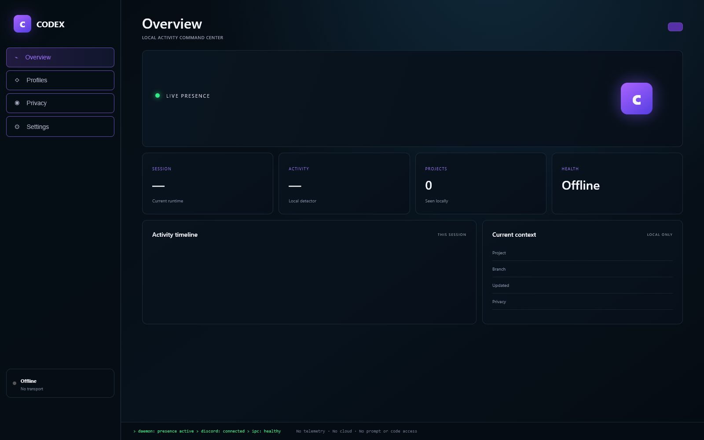

# Codex Presence

Privacy-first Discord Rich Presence for Codex. Codex Presence watches local Codex session metadata, publishes a conservative activity summary to the Discord desktop client, and keeps project details private unless you explicitly share them.



> Community-made. Not affiliated with or endorsed by OpenAI or Discord.

## Downloads

Release installers and checksums are published on the [GitHub Releases page](https://github.com/EpicIsTheOne/Codex-Presence/releases).

| Platform | Package | Release status |
| --- | --- | --- |
| Windows 10/11 x64 | Assisted `.exe` installer | Locally packaged and release-tested |
| Linux x64 | AppImage and `.deb` | Build pipeline prepared; platform validation pending |
| macOS Apple Silicon | Unsigned `.dmg` and `.zip` | Native CI build prepared; validation pending |
| macOS Intel | Unsigned `.dmg` and `.zip` | Native CI build prepared; validation pending |

The macOS packages are intentionally unsigned and not notarized. Linux tray behavior depends on desktop environment AppIndicator support. Platform rows are promoted to supported only after a native test pass.

## What it does

- Detects active Codex sessions locally.
- Shows coding, editing, testing, planning, approval, and idle states on Discord.
- Hides project names by default and supports per-project privacy.
- Removes presence after a configurable idle timeout.
- Provides profiles, automation rules, diagnostics, and a privacy panic control.
- Runs as a tray application and can launch at login.
- Uses the built-in Discord Application ID; no user token, bot token, client secret, or manual Discord setup is required.

Codex Presence never reads prompt contents or source files for Discord presence. Full project paths are not published.

## Windows installation

1. Download the latest Windows x64 installer from [Releases](https://github.com/EpicIsTheOne/Codex-Presence/releases/latest).
2. Run the installer and choose the installation directory and shortcuts.
3. Keep the Discord desktop client running.
4. Launch **Codex Presence** from the Start Menu.

The installer is currently unsigned, so Windows may show a SmartScreen warning. Upgrades reuse the same application identity and preserve settings in the user's application-data directory. Uninstalling does not delete settings by default.

## Development

Requirements: Node.js 22 or newer and npm.

```bash
npm ci
npm run typecheck
npm test
npm run build
npm start
```

Additional check: `npm run lint`.

## Packaging

Packaging uses `electron-builder`:

```bash
npm run package:win
npm run package:linux
npm run package:mac
```

Build macOS artifacts on macOS. Cross-platform release jobs live in [`.github/workflows/release.yml`](.github/workflows/release.yml). A tagged build such as `v1.0.0` publishes artifacts and SHA-256 checksums after all platform jobs succeed.

### Official Discord Social SDK bridge

Windows packages built on the maintainer machine include an isolated x64 Discord Social SDK sidecar when the official SDK is available locally. SDK headers, import libraries, and downloaded binaries are intentionally excluded from the public source repository. Follow [`vendor/discord-social-sdk/README.md`](vendor/discord-social-sdk/README.md) to prepare it locally, then run:

```powershell
npm run native:configure
npm run native:build
npm run package:win
```

When the native bridge is absent, the existing local Discord RPC transport is used as a cross-platform fallback.

## Optional Discord assets screen

The advanced Discord Assets screen is excluded from normal production builds. Maintainers can enable it explicitly:

```powershell
$env:CODEX_ENABLE_ASSETS='1'
npm run build
```

## Release process

See [`docs/RELEASING.md`](docs/RELEASING.md) for the release checklist, unsigned-build policy, native platform validation requirements, and artifact naming.

## Security and privacy reports

Please use GitHub issues for reproducible bugs without sensitive data. Review exported diagnostics before posting them. Do not include prompts, source code, private project names, tokens, or full paths.
